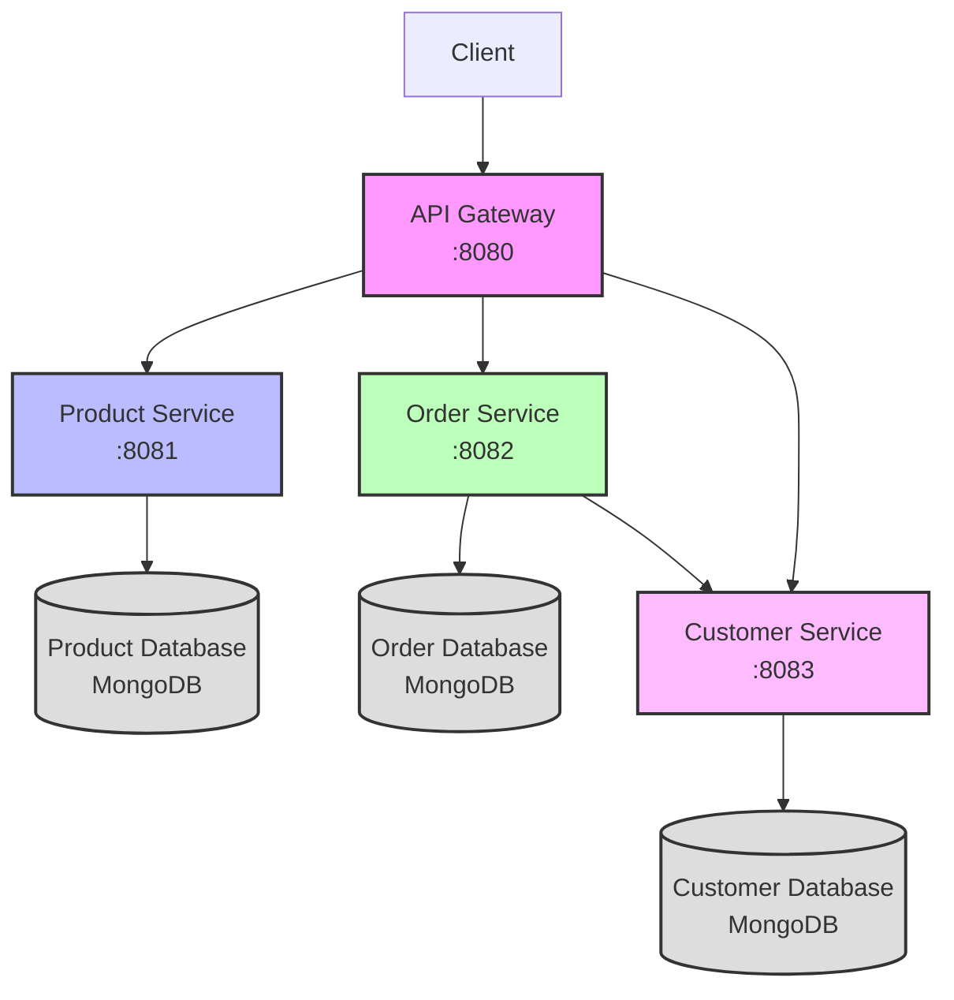

## Service Interaction Flow

1. **Client to API Gateway**:

   - All client requests go through the API Gateway (port 8080)
   - The gateway routes requests to the appropriate service

2. **API Gateway to Services**:

   - Product requests → Product Service (port 8081)
   - Order requests → Order Service (port 8082)
   - Customer requests → Customer Service (port 8083)

3. **Service-to-Service Communication**:

   - Order Service may verify customer existence with Customer Service
   - Each service operates independently with its own database

4. **Database per Service**:
   - Product Service uses its own MongoDB database
   - Order Service uses its own MongoDB database
   - Customer Service uses its own MongoDB database

## API Endpoints

### Product Service

- `GET /api/products` - Get all products
- `GET /api/products/:id` - Get a specific product
- `POST /api/products` - Create a new product
- `PUT /api/products/:id` - Update a product
- `DELETE /api/products/:id` - Delete a product

### Order Service

- `GET /api/orders` - Get all orders
- `GET /api/orders/:id` - Get a specific order
- `GET /api/orders/customer/:customerId` - Get orders by customer
- `POST /api/orders` - Create a new order
- `PUT /api/orders/:id` - Update an order
- `DELETE /api/orders/:id` - Delete an order

### Customer Service

- `GET /api/customers` - Get all customers
- `GET /api/customers/:id` - Get a specific customer
- `POST /api/customers` - Create a new customer
- `PUT /api/customers/:id` - Update a customer
- `DELETE /api/customers/:id` - Delete a customer
